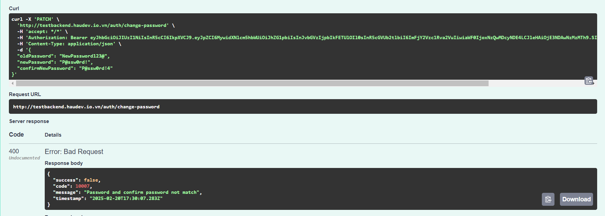

# Bài test Backend NodeJS : Lê Trung Hậu

# Link deploy dự án :
```javascript     
http://testbackend.haudev.io.vn/swagger
```
- Backend : Nodejs(NestJS)
- Database : PostgreSQL
- Caching : localCache
- Security : accessToken, refreshToken, RateLimiter, BlackList
- Ops : Ec2, docker-compose, github actions

# Cấu trúc dự án

- libs : 1 module dùng để khai báo các hàm, biến được chia sẻ với nhau trong source code
- src : nơi tập trung các module chính
- data : volumn của docker
- prisma : lưu file .prisma của ORM prisma
- .github : chứa file cấu hình github action

# Mô tả API :
## Login : /auth/login
- Thành công :  
- Sai Tên tài khoản : 

- Sai mật khẩu : 

## register : /auth/register

- Thành công : 
- Trùng Tên tài khoản : 


## refresh token : /auth/refresh_token truyền vào header 'x-refresh-token'
 - Thành công : 
 - Truyền sai : 


## Change password : /auth/change_password
 - Thành công :
 - Sai mật khẩu gốc : 
 - new Password và config password khác nhau : 
 - Mật khẩu mới và mật khẩu cũ giống nhau : 

## Lấy danh sách user : /employees chỉ có quyền admin mới được xem danh sách user 
- Không có quyền : 
- Lấy danh sách : [danh-sachs](moTaDuAn/get_employee.png)

## Lấy thông tin info của chính mình
- Thành công : 

## Update thông tin bản thân /patch : employee/me
- Thành công : 

## deactive tài khoản bản thân /delete : employee/me
- thành công : 
- Không tìm thấy : khi deactive thì id của tài khoản vừa deactive sẽ được thêm vào blacklist với ttl bằng thời gian sống bằng token : 


## Cập nhật thông tin user khi có quyền ADMIN
-- không có quyền 
-- không tìm thấy user  
-- update thành công 